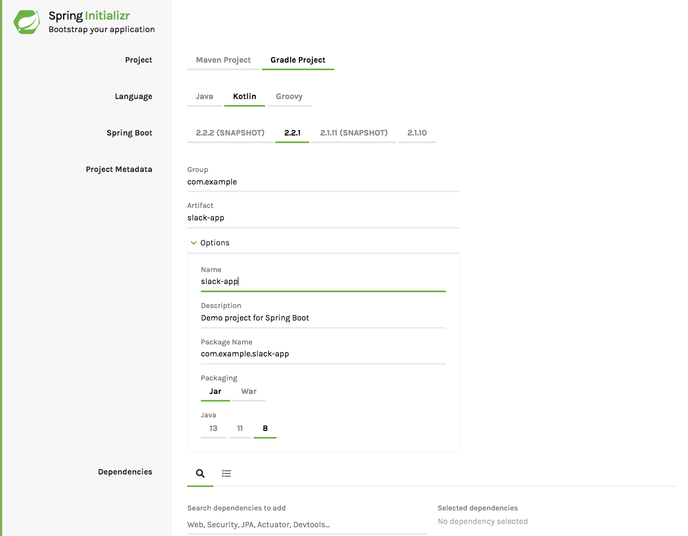

= Your First Slack Application
This guide walks you through the process of using Slack Spring Boot Starter to build an application that is the base for a slack application

== What You Will Build

== What You Need

== How to complete this guide

- About 15 minutes
- A favorite text editor or IDE
- JDK 1.8 or later

== Starting with Spring Initializr
For all Spring applications, you should start with the Spring Initializr. The Initializr offers a fast way to pull in all the dependencies you need for an application
and does a lot of the set up for you. This example doesn't need any additional dependencies. The following images shows the recommended settings.

The following listing shows the build.gradle.kts file that was created:

[source,kotlin]
----
import org.jetbrains.kotlin.gradle.tasks.KotlinCompile

plugins {
	id("org.springframework.boot") version "2.2.1.RELEASE"
	id("io.spring.dependency-management") version "1.0.8.RELEASE"
	kotlin("jvm") version "1.3.50"
	kotlin("plugin.spring") version "1.3.50"
}

group = "com.example"
version = "0.0.1-SNAPSHOT"
java.sourceCompatibility = JavaVersion.VERSION_1_8

repositories {
	mavenCentral()
}

dependencies {
	implementation("org.springframework.boot:spring-boot-starter")
	implementation("org.jetbrains.kotlin:kotlin-reflect")
	implementation("org.jetbrains.kotlin:kotlin-stdlib-jdk8")
	testImplementation("org.springframework.boot:spring-boot-starter-test") {
		exclude(group = "org.junit.vintage", module = "junit-vintage-engine")
	}
}

tasks.withType<Test> {
	useJUnitPlatform()
}

tasks.withType<KotlinCompile> {
	kotlinOptions {
		freeCompilerArgs = listOf("-Xjsr305=strict")
		jvmTarget = "1.8"
	}
}
----

As a last step you need to add the Slack Spring Boot Starter Dependency
[source,kotlin]
----
implementation(group = "com.kreait.slack", name = "slack-spring-boot-starter", version = "1.0.0")
----

